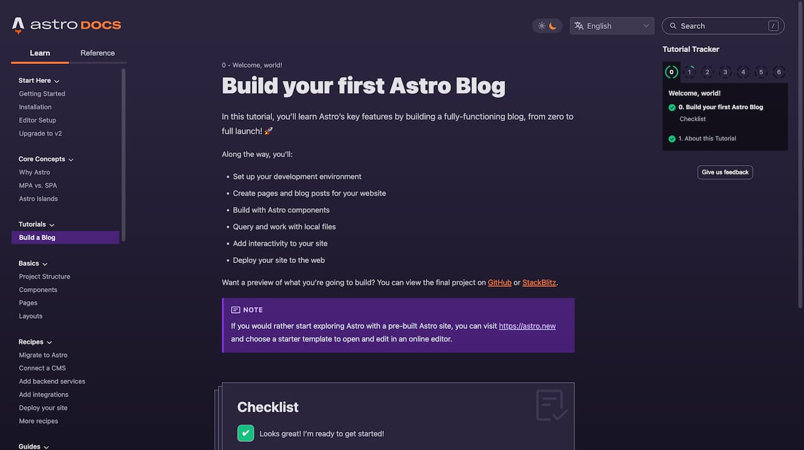
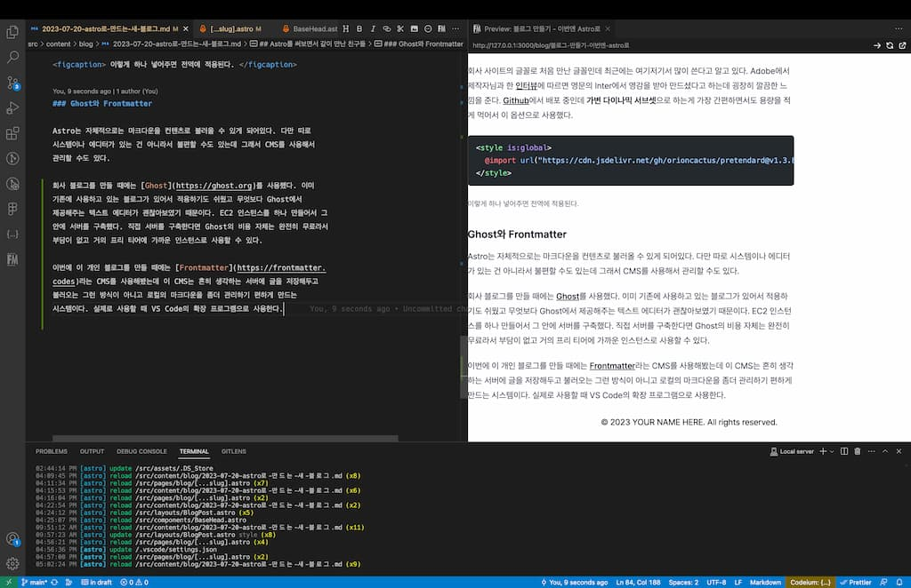

## 다시 블로그 만들기

'할 줄 아는 것 같다' 라는 느낌이 참 무서운게, 약간 내 마음대로 하고 싶은 일이나 돈을 조금 쓰면 편하게 할 수 있는 일을 굳이 직접 하려고 한다. 어릴 때 조립 컴퓨터라는게 그랬고(지금은 하나씩 사는게 아니라면 무조건 조립은 맡긴다.) 웹 개발을 배우고 나니 홈페이지가 그렇다. 블로그 만들어주는 곳이 그렇게 많은데, 또 뭔가 만들어 볼 수 있는 게 하나 보이니까 벌써 어디에다 배포하는 게 좋을까 고민하고 있는게 참 바보같단 생각도 든다 😓.

아무튼 이번엔 [Astro](https://astro.build)로 만들어봤다. 사실 이걸로 이미 회사 블로그를 하나 만들어봤는데 그때 워낙 경험이 좋아서 이번에는 개인 블로그로 만들어보기로 했다. 어떤 점이 그렇게 마음에 들었는지 이야기해보기로 한다.

## Astro가 마음에 드는 점

### 일단 쉽다

사실 어느 스택의 공식 홈페이지를 들어가도 자기들은 쉽다고 주장하긴 하지만 막상 쓰다보면 그렇게 쉽지는 않은 것이 현실인데 Astro는 정말로 입문이 쉬웠었다. 공식 문서가 꽤 잘되어있는 편이고 튜토리얼도 친절하게 되어있었다. 컴포넌트 문법은 React나 Vue 등을 써본 사람이라면 금방 익숙해질 수 있는 편이고 프로젝트 구조 역시 요새 Next, Nuxt 등 SSR 프레임워크가 사용하는 방식이라 바로 알 수 있었다. 예를 들면 파일/폴더로 웹사이트의 URL을 만드는 방식이라든가.



<figcaption>
Astro의 <a href="https://docs.astro.build/en/tutorial/0-introduction/">블로그 만들기 튜토리얼</a>. 단계별로 따라했을 때 큰 도움이 됐다.
</figcaption>

무엇보다 자체적으로 사용하는 astro 형식이 쓰기 편했다. React, Vue, Svelte 등 프론트엔드 라이브러리에서 좋았던 점만 쏙쏙 골라온 느낌이랄까. 개인적으로는 Vue의 `v-for`나 Svelte의 `{#each}`같은 문법보다는 React의 JSX를 좋아하고 또 React에서 `children`을 일일이 props에서 가져오는 것보다는 Vue의 `slot` 방식을 더 좋아하는데 그 두 개가 전부 가능해서 딱 취향에 맞았다. 최대한 자신들만 쓰는 자체 문법을 자제한 느낌이라고 할까.

### 정적 사이트라 좋다

SSG를 써본 것은 Astro가 처음이었는데 만족도가 굉장히 높았다. 일단 한번 빌드하고 나면 불러오는 속도가 빨라서 좋았고 CSR, SSR 등에서 고민해야 하는 문제를 생각하지 않고 단순하게 접근할 수 있는 그 접근 방식이 좋았다. 물론 컨텐츠의 변경 하나에도 재배포해야하는 점이 조금 불편하기는 했지만 블로그라는게 실시간 데이터가 그렇게 중요한 것도 아니고 개설 초기만 아니면 그렇게 자주 바꿀 일도 없을 것 같아서 큰 이슈는 아니라고 생각했다. 다른 무엇보다 처음에 이야기한 속도, 퍼포먼스가 너무 마음에 들었다.

### 자유도가 높다

블로그에 완전 특화된 것도 아니고 어떤 사이트든 만들 수 있다. 원한다면 SSR과 SSG 방식을 섞어서 사용할 수도 있다. 메이저한 FE 라이브러리는 다 지원하고 심지어 섞어쓸 수도 있다. 특정 부분만 React로 구현한다거나 하는 방식도 얼마든지 가능하다. 다양한 통합 라이브러리가 준비되어있고 개발팀의 속도도 굉장히 빠른 것 같아서 앞으로 추가되는 것도 기대할 수 있다. (이미지 플러그인이 처음 볼때만 해도 실험 중이었는데 어느새 deprecated되어서 다음 버전부터는 다른 걸로 대체된다고 되어있다.)

```astro
---
import MyReactComponent from "../components/MyReactComponent.jsx";
import MySvelteComponent from "../components/MySvelteComponent.svelte";
import MyVueComponent from "../components/MyVueComponent.vue";
---

<div>
  <MySvelteComponent />
  <MyReactComponent />
  <MyVueComponent />
</div>
```

<figcaption>무려 이렇게 가능하다. 혼자 쓴다면 특정 기술을 새로 써보고 싶을 때 자유롭게 쓸 수 있고 협업해서 관리하는 사이트라면 무슨 스택을 쓰든 자유롭게 사용할 수 있다. (코드 출처: Astro 공식 홈페이지 예시)</figcaption>

## Astro를 써보면서 같이 만난 친구들

### @tailwind/typography

블로그를 만들 때 디자인도 사실 굉장히 고민되는 점이었는데 특히 글을 읽는 이 부분을 어떻게 할지가 굉장히 고민이었다. 많은 기업 블로그를 참고해봐도 흐름은 어느 정도 잡혔지만 약간 막막한 느낌이 있었는데 그때 [Tailwind의 Typography 플러그인](https://tailwindcss.com/docs/typography-plugin)을 발견했다.

플러그인을 적용하고 글 영역에 `prose` 클래스 하나만 추가해주면 어쩐지 굉장히 낯익으면서도 보기 좋은 디자인이 적용이 된다. 무엇보다 마크다운 형식으로 적은 글과 굉장히 잘 어울리는데 Astro는 기본적으로는 마크다운 기반이기 때문에 잘 어울린다. 위에서 볼 수 있듯이 코드 블럭도 언어만 잘 지정해주면 예쁘게 만들어준다. 글 디자인은 이거 하나로 마무리해버린 것 같다.

### Pretendard

회사 사이트의 글꼴로 처음 만난 글꼴인데 최근에는 여기저기서 많이 쓴다고 알고 있다. Adobe에서 제작자님과 한 [인터뷰](https://blog.adobe.com/ko/publish/2022/09/19/font-of-the-month-pretendard)에 따르면 영문의 Inter에서 영감을 받아 만드셨다고 하는데 굉장히 깔끔한 느낌을 준다. [Github](https://github.com/orioncactus/pretendard)에서 배포 중인데 **가변 다이나믹 서브셋**으로 하는게 가장 간편하면서도 용량을 적게 먹어서 이 옵션으로 사용했다.

```html
<style is:global>
  @import url("https://cdn.jsdelivr.net/gh/orioncactus/pretendard@v1.3.8/dist/web/variable/pretendardvariable-dynamic-subset.css");
</style>
```

<figcaption> 이렇게 하나 넣어주면 전역에 적용된다. </figcaption>

### Ghost와 Frontmatter

Astro는 자체적으로는 마크다운을 컨텐츠로 불러올 수 있게 되어있다. 다만 따로 시스템이나 에디터가 있는 건 아니라서 불편할 수도 있는데 그래서 CMS를 사용해서 관리할 수도 있다.

회사 블로그를 만들 때에는 [Ghost](https://ghost.org)를 사용했다. 이미 기존에 사용하고 있는 블로그가 있어서 적용하기도 쉬웠고 무엇보다 Ghost에서 제공해주는 텍스트 에디터가 괜찮아보였기 때문이다. EC2 인스턴스를 하나 만들어서 그 안에 서버를 구축했다. 직접 서버를 구축한다면 Ghost의 비용 자체는 완전히 무료라서 부담이 없고 거의 프리 티어에 가까운 인스턴스로 사용할 수 있다.

이번에 이 개인 블로그를 만들 때에는 [Frontmatter](https://frontmatter.codes)라는 CMS를 사용해봤는데 이 CMS는 흔히 생각하는 서버에 글을 저장해두고 불러오는 그런 방식이 아니고 로컬의 마크다운을 좀더 관리하기 편하게 만드는 시스템이다. 실제로 사용할 때 VS Code의 확장 프로그램으로 사용한다.



<figcaption>이렇게 미리보기 등을 지원하고 확장 프로그램 창에서 마크다운의 정보를 쉽게 변경할 수 있는 툴이다. CMS라기보다는 마크다운의 보조 프로그램 같은 느낌.</figcaption>

블로그를 쓰면서 마크다운 문법에 익숙해지고 싶은 마음이 있고 CMS를 찾아봐도 다 불필요하게 복잡하거나 유료 서비스라서 이걸 사용해봤는데 꽤 괜찮은 경험이었다.
